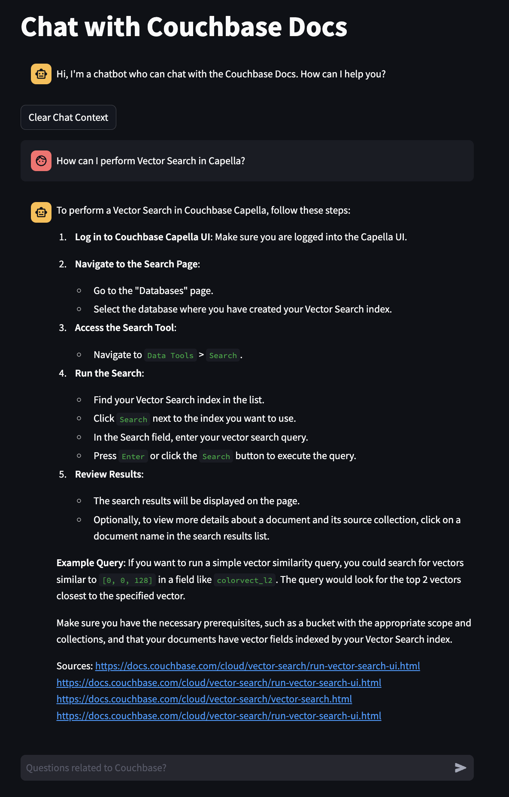

## Q&A ChatBot Demo using Couchbase, Streamlit, LangChain, LangSmith and OpenAI

This is a demo Q&A ChatBot built to chat with documentation websites using the Vector Search capabilities of Couchbase to augment the OpenAI results in a Retrieval-Augmented-Generation (RAG) model. It uses [LangChain](https://python.langchain.com/docs/use_cases/question_answering/) to orchestrate the entire workflow.

### How does it work?

You can ask questions about the documentation that has been indexed into the Vector Store. You will get answers from the documentation along with some additional sources to get more information from the documentation website.



You can also ask follow up questions. The chat bot will summarize the previous chat history to find relevant answers.

We are using Streamlit, LangChain, Couchbase Vector Search & OpenAI along with [LangSmith](https://docs.smith.langchain.com/) for observability into the bot.

Note that currently the chat history is not linked to any user. Hence, when multiple users are using the application, you might need to get rid of the chat history by clicking on the "Clear Chat Context" in the UI.

### How to Run

- #### Install dependencies

  `pip install -r requirements.txt`

- #### Set the environment secrets

  Copy the `.env.example` file and rename it to `.env` and replace the placeholders with the actual values for your environment

  ```
  OPENAI_API_KEY="<open_ai_api_key>"
  DB_CONN_STR="<connection_string_for_couchbase_cluster>"
  DB_USERNAME="<username_for_couchbase_cluster>"
  DB_PASSWORD="<password_for_couchbase_cluster>"
  DB_BUCKET="<name_of_bucket_to_store_documents>"
  DB_SCOPE="<name_of_scope_to_store_documents>"
  DB_COLLECTION="<name_of_collection_to_store_documents>"
  INDEX_NAME="<name_of_fts_index_with_vector_support>"
  LOGIN_PASSWORD="<password to access the streamlit app>"
  LANGCHAIN_TRACING_V2=true
  LANGCHAIN_ENDPOINT="https://api.smith.langchain.com"
  LANGCHAIN_API_KEY="<api_key_for_langsmith>"
  ```

- #### Create a List of URLs to Index into Vector Store

  We need to index the documents that the Q&A ChatBot can answer. For this, there in an ingestion script, `ingest_docs.py` that can be used to ingest the documents into Couchbase Vector Store.

  For the list of documents, you can use the template `file_with_urls.json.example`. You can copy the file into `file_with_urls.json` and add your list of URLs to support.

  The file has the format of one URL per line of the document like the following:

  ```json
  [
    {
      "URL": "https://docs.couchbase.com/cloud/index.html"
    },
    {
      "URL": "https://docs.couchbase.com/cloud/index.html"
    }
  ]
  ```

  The list of URLs supported by the ChatBot can be determined possibly using the website's sitemap.

- #### Create the Search Index on Full Text Service

  We need to create the Search Index on the Full Text Service in Couchbase. For this demo, you can import the following index using the instructions.

  - [Couchbase Capella](https://docs.couchbase.com/cloud/search/import-search-index.html)

    - Copy the index definition to a new file index.json
    - Import the file in Capella using the instructions in the documentation.
    - Click on Create Index to create the index.

  - [Couchbase Server](https://docs.couchbase.com/server/current/search/import-search-index.html)

    - Click on Search -> Add Index -> Import
    - Copy the following Index definition in the Import screen
    - Click on Create Index to create the index.

  #### Index Definition

  Here, we are creating the index `docs-search` on the documents in the `_default` collection within the `_default` scope in the bucket `docs`. The Vector field is set to `embeddings` with 1536 dimensions and the text field set to `text`. We are also indexing and storing all the fields under `metadata` in the document as a dynamic mapping to account for varying document structures. The similarity metric is set to `dot_product`. If there is a change in these parameters, please adapt the index accordingly.

  ```json
  {
    "type": "fulltext-index",
    "name": "docs._default.docs-search",
    "uuid": "2aefca04031a299d",
    "sourceType": "gocbcore",
    "sourceName": "docs",
    "planParams": {
      "maxPartitionsPerPIndex": 1024,
      "indexPartitions": 1
    },
    "params": {
      "doc_config": {
        "docid_prefix_delim": "",
        "docid_regexp": "",
        "mode": "scope.collection.type_field",
        "type_field": "type"
      },
      "mapping": {
        "analysis": {},
        "default_analyzer": "standard",
        "default_datetime_parser": "dateTimeOptional",
        "default_field": "_all",
        "default_mapping": {
          "dynamic": false,
          "enabled": false
        },
        "default_type": "_default",
        "docvalues_dynamic": false,
        "index_dynamic": true,
        "store_dynamic": true,
        "type_field": "_type",
        "types": {
          "_default._default": {
            "dynamic": false,
            "enabled": true,
            "properties": {
              "embedding": {
                "dynamic": false,
                "enabled": true,
                "fields": [
                  {
                    "dims": 1536,
                    "index": true,
                    "name": "embedding",
                    "similarity": "dot_product",
                    "type": "vector",
                    "vector_index_optimized_for": "recall"
                  }
                ]
              },
              "metadata": {
                "dynamic": true,
                "enabled": true
              },
              "text": {
                "dynamic": false,
                "enabled": true,
                "fields": [
                  {
                    "analyzer": "en",
                    "index": true,
                    "name": "text",
                    "store": true,
                    "type": "text"
                  }
                ]
              }
            }
          }
        }
      },
      "store": {
        "indexType": "scorch",
        "segmentVersion": 16
      }
    },
    "sourceParams": {}
  }
  ```

- #### Ingest the Documents

  `python ingest_docs.py`

- #### Run the Application

  `streamlit run bot_ui.py`
